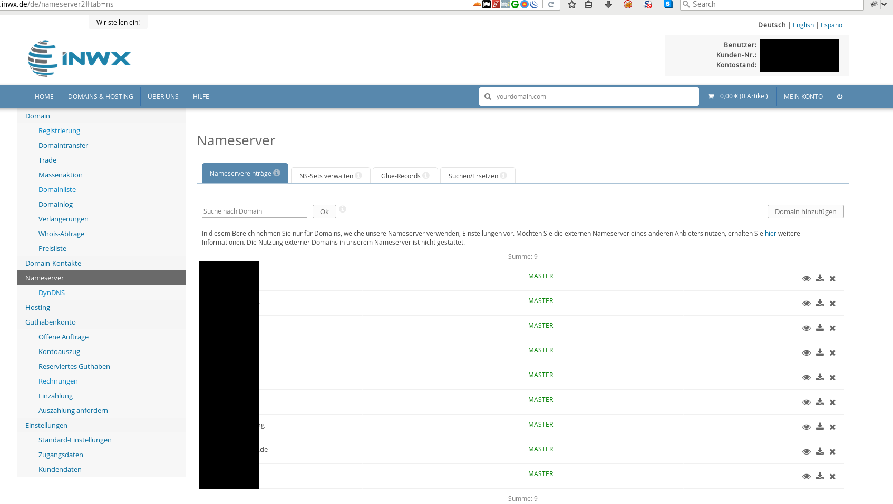
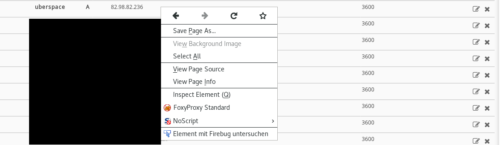
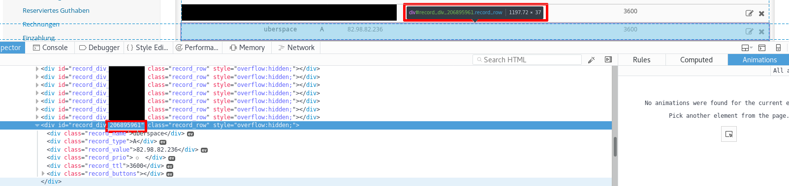

= INWX DynDNS Script

This is a small bash script, which works as a DynDNS updater. It works only with domains which are registered at https://inwx.de[inwx.de]. It only updates the ip record, if the ip has changed.

== Requirements

This script does not require any additional tools. All tools should be available on a regular linux system:

* curl
* sed

== Installation

. Create a new directory in your home folder. E.g. dyndns.

----
mkdir ~/dyndns
cd ~/dyndns

----

. 

Clone the files from github

----
git clone git@github.com:gehaxelt/Bash-INWX-DynDNS.git .
----

. Edit the dnsupdate.sh and fill in your login credentials.

. Get the wished dns entry ID from the inwx website and set it in the script. See below how to get the ID. 
When you not have an ID (like IPv6) than use `DNSIDsv6=()`, an empty array. When you have one ID (like 7654321), use `DNSIDsv6=(&quot;7654321&quot;)` and if you have multiple IDs use `DNSIDsv6=(&quot;7654321&quot; &quot;8901234&quot;)`, same usage for IPv4.

. If desired, enter at `UPDATEURLv4=&quot;&quot;` the URL from which the IPv4 address should be retrieved, same for IPv6.
. Edit your crontab. For a 5-minutes update use: `*/5 * * * * cd /home/$USER/dyndns &amp;&amp; bash dnsupdate.sh`

== How to obtain the DNS entry ID?

First, login to the https://inwx.de[inwx] website. Navigate to "Nameserver" section:

Then open the DNS entries for your domain and right-click on the entry you'd like to dynamically update. Choose the "inspect element" menue entry.

Now you should see the developer tools and a `&lt;div&gt;`-element. The number in the `id`-attribute's value after `record_div_` is the wanted number.

Copy this ID (here: 206895961) into your script.

Alternatively you can use the https://www.inwx.de/de/help/apidoc/f/ch02s09.html#nameserver.info[INWX API] to obtain the record id.
